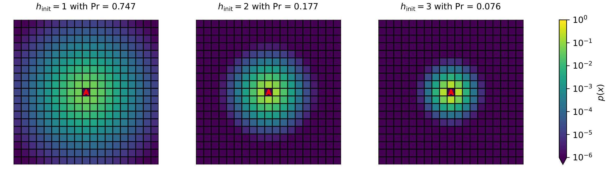

.. _sec-initialization:

Initialization
==============

Because tracking can only start once the searcher knows that a source exists (that is, after a detection event has
occurred), the search is initialized by a nonzero hit.
The set of priors is the set generated by each possible nonzero hit value.

  A set of initial beliefs :math:`p_0` with the corresponding values of the initial hit
  and probabilities of occurring shown on top. "A" indicates the agent's position, at the center of the domain.

Unless specified, the domain size (called ``N_GRID`` in the code) is automatically chosen "large enough" to mimic
an open domain.

The full procedure is detailed in [Loisy2022]_.
