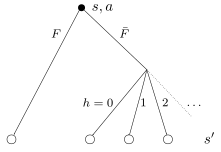

========
Policies
========

The agent's behavior is controlled by a policy, denoted :math:`\pi`, which maps each belief state :math:`s`
to an action :math:`a`. For a deterministic policy (as seeked here, since the optimal policy is deterministic),
the action chosen is :math:`a = \pi(s)`.

Optimal policy
==============

We denote :math:`\text{Pr}(s'|s,a)` the probability of transitioning from belief state :math:`s`
to next belief state :math:`s'` after executing action :math:`a`.
Possible transitions from :math:`s` to :math:`s'` corresponds to possible observations:
either finding the source (event :math:`F`)
or not finding the source (event :math:`\bar{F}`) and receiving :math:`h` hits, as illustrated below.

  Tree of possible successor belief states :math:`s'` starting from a belief state :math:`s` and executing action :math:`a`

*in construction*

Infotaxis
=========

Infotaxis is a heuristic policy proposed by Vergassola et al. (Nature, 2007).
It states that the agent should choose the action from which it expects the greatest information gain about
the source location.

The physical intuition behind this strategy is, quoting the authors, that
"information accumulates faster close to the source because cues arrive at a higher rate,
hence tracking the maximum rate of information acquisition will guide the searcher to the source much like
concentration gradients in chemotaxis".

*in construction*

Space-aware infotaxis
=====================

Space-aware infotaxis is a variant of infotaxis that has been shown to perform better in most cases
(Loisy and Eloy, arxiv, 2022).

*in construction*

Greedy policy
=============

The *greedy* policy is a short-sighted policy which chooses the action maximizes the probability of
finding the source in the next cell

.. math::
    \begin{equation}
     \pi^{\text{greedy}}(s) = \text{argmax}_a \, p({\bf x}^a(a)).
    \end{equation}

where :math:`{\bf x}^a(a)` is the new agent position after executing action :math:`a`.

Mean distance policy
====================

The *mean distance* policy is based on the intuitive idea that the agent should get, on average, closer to the source.
For a belief state :math:`s=[{\bf x}^a, p({\bf x})]`, the mean distance to the source is

.. math::
    \begin{equation}
     D(s) = \sum_{{\bf x}} p({\bf x}) \lVert {\bf x} - {\bf x}^a \rVert_1.
    \end{equation}

where we use the Manhattan norm :math:`\lVert \cdot \rVert_1`.

The expected value of the mean distance upon executing action :math:`a` in belief state :math:`s` is given by

.. math::
    \begin{equation}
     D(s | a) = \sum_{s'} \text{Pr}(s'|s,a) D(s')
    \end{equation}

where the sum is taken over all successor belief states :math:`s'`.

The mean distance policy is then defined by

.. math::
    \begin{equation}
     \pi^{\text{mean distance}}(s) = \text{argmin}_a \,  D(s | a)
    \end{equation}

and consists in choosing the action that minimizes the expected distance to the source at the next step.

Voting policy
=============

The *voting* policy chooses the action that is the most likely to be optimal.

It determines the optimal action for each possible source location, weights each action by the corresponding
probability of that location being the true source location, and picks the action with the highest probability.

The probability that action :math:`a` is optimal is

.. math::
    \begin{equation}
     w(a) = \sum_{{\bf x}} p({\bf x}) \phi(a^*({\bf x}) = a)
    \end{equation}

where :math:`\phi` has value 1 if the argument is true and 0 otherwise, and where :math:`a^*({\bf x})` denote the
optimal action for a source located in :math:`{\bf x}`, which is given by

.. math::
    \begin{equation}
     a^*({\bf x}) = \text{argmin}_a \, \lVert {\bf x} - {\bf x}^a(a) \rVert_1.
    \end{equation}

where :math:`{\bf x}^a(a)` is the new agent position after executing action :math:`a` and where
:math:`\lVert \cdot \rVert_1` is the Manhattan norm.

The voting policy then reads

.. math::
    \begin{equation}
     \pi^{\text{voting}}(s) = \text{argmax}_a \, w(a).
    \end{equation}

It was originally proposed by Cassandra, Kaelbling & Kurien (IEEE, 1996) for robotic navigation.

Most likely state policy
========================

The *most likely state policy* finds the most likely source location, and executes the action that would be optimal
for that location.
In other words, the agent executing this policy moves in the direction of the most likely source location.

This reads

.. math::
    \begin{equation}
     \pi^{\text{mls}}(s) = \text{argmin}_a \, \lVert {\bf x}^{\text{mls}} - {\bf x}^a(a) \rVert_1
    \end{equation}

where :math:`{\bf x}^a(a)` is the new agent position after executing action :math:`a`,
where :math:`\lVert \cdot \rVert_1` is the Manhattan norm, and
where :math:`{\bf x}^{\text{mls}}` is the most likely source location

.. math::
    \begin{equation}
     {\bf x}^{\text{mls}} = \text{argmax}_{{\bf x}} \, p({\bf x}).
    \end{equation}

It was originally proposed by Cassandra, Kaelbling & Kurien (IEEE, 1996) for robotic navigation.