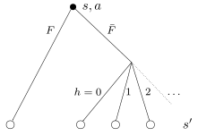

.. _sec-policy-definition:

===========
Definitions
===========

The agent's behavior is controlled by a policy, denoted :math:`\pi`, which maps each belief state :math:`s`
to an action :math:`a`. That is, at each step the action is chosen according to :math:`a = \pi(s)`.

The various policies defined in the following are already implemented in OTTO (except the optimal policy, which is not
computable).

Optimal policy
==============

The *optimal policy* is denoted :math:`\pi^*` and is defined as the policy that minimizes the duration
of the search.
It can be determined from the solution of a recurrence equation known as the Bellman optimality equation
as follows.

The optimal value function :math:`v^*(s)`of a belief state :math:`s` is defined as the minimum, over all policies,
of the expected number of steps remaining to find the source when starting from belief state :math:`s`:

.. math::
   \begin{equation}
   v^*(s) = \min_\pi v^\pi(s) \qquad \text{where} \quad v^\pi(s) = \mathbb{E}_{\pi} [T - t | s_t = s].
   \end{equation}

It satisfies the Bellman optimality equation:

.. math::
   \begin{equation}
   v^*(s) = \min_a \sum_{s'} \Pr(s'|s,a) [1 + v^*(s')]    \qquad  \forall s \neq s^\Omega
   \end{equation}

where :math:`\text{Pr}(s'|s,a)` is the probability of transitioning from belief state
:math:`s` to next belief state :math:`s'` after executing action :math:`a`, and where
:math:`v^*(s^\Omega) = 0` (by definition of the terminal state :math:`s^\Omega`).
Possible transitions from :math:`s` to :math:`s'` corresponds to possible observations:
either finding the source (event :math:`F`)
or not finding the source (event :math:`\bar{F}`) and receiving :math:`h` hits, as illustrated below.

  Tree of possible successor belief states :math:`s'` starting from a belief state :math:`s` and executing action :math:`a`

Given :math:`v^*(s)`, the *optimal policy* consists in choosing the action that minimizes the expected number of
remaining steps :math:`v^*(s')`:

.. math::
   \begin{equation}
   \pi^*(s) = \text{argmin}_a \, \sum_{s'} \text{Pr} (s'|s,a) [1 + v^*(s')].
   \end{equation}

The continuous nature of the belief state prevents from computing the optimal value function exactly.
But near-optimal value functions can be approximated by neural networks trained using :ref:`deep reinforcement learning<sec-rl>`.

Neural network policy
=====================

The *neural network* policy is

.. math::
   \begin{equation}
   \pi^{\text{NN}}(s) = \text{argmin}_a \, \sum_{s'} \text{Pr} (s'|s,a) [1 + \hat{v}^*(s', {\bf w})].
   \end{equation}

where :math:`\hat{v}^*(s', {\bf w})` is an approximation of the optimal value function computed by a
multi-layer neural network with weights :math:`{\bf w}`.

To optimize their weights, neural networks are :ref:`trained using reinforcement learning<sec-training>`.

Near-optimal policies can be obtained if large enough neural networks are used.
:ref:`sec-trained` yielding a near-optimal policy are provided in the ``zoo`` directory.

Infotaxis
=========

The *infotaxis* policy states that the agent should choose the action from which it expects the greatest information
gain about the source location.
It reads

.. math::
   \begin{equation}
   \pi^{\text{infotaxis}}(s) = \text{argmax}_a \, \sum_{s'} \left[ H(s) - \text{Pr}(s'|s,a) H(s') \right]
   \end{equation}

where :math:`H(s)` is the Shannon entropy of belief state :math:`s = [{\bf x}^a, p({\bf x})]`:

.. math::
   \begin{equation}
   H(s) = - \sum_{{\bf x}} p({\bf x}) \log_2 p({\bf x}).
   \end{equation}

Infotaxis was proposed by Vergassola et al. [Vergassola2007]_.

The physical intuition behind this strategy is, quoting the authors, that
"information accumulates faster close to the source because cues arrive at a higher rate,
hence tracking the maximum rate of information acquisition will guide the searcher to the source much like
concentration gradients in chemotaxis".

Infotaxis is far superior to all naive strategies, such as going to the more likely source location, but it is
not optimal.

N-step infotaxis
================

Infotaxis is based on a one-step anticipation of possible outcomes of each action.
N-step infotaxis is the generalization of infotaxis to an anticipation over an arbitrary number of steps.
It maximizes the cumulated information gain over those steps.

The detailed algorithm relies on an exhaustive tree search [Loisy2022]_.

The number of anticipated steps is called ``STEPS_AHEAD`` in the code.

Space-aware infotaxis
=====================

The *space-aware infotaxis* policy is variant of infotaxis shifted toward more exploitaton.
It reads

.. math::
   \begin{equation}
   \pi^{\text{SAI}}(s) = \text{argmin}_a \, \sum_{s'} \text{Pr}(s'|s,a) J(s')
   \end{equation}

where :math:`J(s)` is defined by

.. math::
   \begin{align}
   J(s) = \log_2 \left( D(s) + 2^{H(s)-1} - \frac{1}{2} \right)
   \end{align}

with :math:`J(s^\Omega)=0`. In this expression, :math:`H(s)` is the Shannon entropy of
belief state :math:`s = [{\bf x}^a, p({\bf x})]`
and :math:`D(s)` is the mean Manhattan distance between the agent and the source

.. math::
   \begin{equation}
   D(s) = \sum_{{\bf x}} p({\bf x}) \lVert {\bf x} - {\bf x}^a \rVert_1.
   \end{equation}

Space-aware infotaxis was proposed by Loisy and Eloy [Loisy2022]_.
It has been shown to beat infotaxis in most cases, and it believed to be a good approximation of the optimal policy.

Greedy policy
=============

The *greedy* policy is a short-sighted policy which chooses the action maximizes the probability of
finding the source in the next cell

.. math::
   \begin{equation}
   \pi^{\text{greedy}}(s) = \text{argmax}_a \, p({\bf x}^a(a)).
   \end{equation}

where :math:`{\bf x}^a(a)` is the new agent position after executing action :math:`a`.

It a standard policy for MDPs and POMDPs.
It is not a good policy for the source-tracking POMDP.

Mean distance policy
====================

The *mean distance* policy is based on the intuitive idea that the agent should get, on average, closer to the source.
For a belief state :math:`s=[{\bf x}^a, p({\bf x})]`, the mean distance to the source is

.. math::
   \begin{equation}
   D(s) = \sum_{{\bf x}} p({\bf x}) \lVert {\bf x} - {\bf x}^a \rVert_1.
   \end{equation}

where we use the Manhattan norm :math:`\lVert \cdot \rVert_1`.

The expected value of the mean distance upon executing action :math:`a` in belief state :math:`s` is given by

.. math::
   \begin{equation}
   D(s | a) = \sum_{s'} \text{Pr}(s'|s,a) D(s')
   \end{equation}

where the sum is taken over all successor belief states :math:`s'`.

The mean distance policy is then defined by

.. math::
   \begin{equation}
   \pi^{\text{mean distance}}(s) = \text{argmin}_a \,  D(s | a)
   \end{equation}

and consists in choosing the action that minimizes the expected distance to the source at the next step.

It was proposed in [Loisy2022]_, as an example of a naive policy which performs poorly.

Voting policy
=============

The *voting* policy chooses the action that is the most likely to be optimal.

It determines the optimal action for each possible source location, weights each action by the corresponding
probability of that location being the true source location, and picks the action with the highest probability.

The probability that action :math:`a` is optimal is

.. math::
   \begin{equation}
   w(a) = \sum_{{\bf x}} p({\bf x}) \phi(a^*({\bf x}) = a)
   \end{equation}

where :math:`\phi` has value 1 if the argument is true and 0 otherwise, and where :math:`a^*({\bf x})` denote the
optimal action for a source located in :math:`{\bf x}`, which is given by

.. math::
   \begin{equation}
   a^*({\bf x}) = \text{argmin}_a \, \lVert {\bf x} - {\bf x}^a(a) \rVert_1.
   \end{equation}

where :math:`{\bf x}^a(a)` is the new agent position after executing action :math:`a` and where
:math:`\lVert \cdot \rVert_1` is the Manhattan norm.

The voting policy then reads

.. math::
   \begin{equation}
   \pi^{\text{voting}}(s) = \text{argmax}_a \, w(a).
   \end{equation}

It was originally proposed for robotic navigation [Cassandra1996]_.
It is not a good policy for the source-tracking POMDP.

Most likely state policy
========================

The *most likely state policy* finds the most likely source location, and executes the action that would be optimal
for that location.
In other words, the agent executing this policy moves in the direction of the most likely source location.

This reads

.. math::
   \begin{equation}
   \pi^{\text{mls}}(s) = \text{argmin}_a \, \lVert {\bf x}^{\text{mls}} - {\bf x}^a(a) \rVert_1
   \end{equation}

where :math:`{\bf x}^a(a)` is the new agent position after executing action :math:`a`,
where :math:`\lVert \cdot \rVert_1` is the Manhattan norm, and
where :math:`{\bf x}^{\text{mls}}` is the most likely source location

.. math::
   \begin{equation}
   {\bf x}^{\text{mls}} = \text{argmax}_{{\bf x}} \, p({\bf x}).
   \end{equation}

It was originally proposed for robotic navigation [Cassandra1996]_.
It is not a good policy for the source-tracking POMDP.

User-defined policy
===================

Heuristic policies are implemented in ``otto.classes.heuristicpolicy``.
A template for a new policy is provided by the method ``_custom_policy`` of the class ``HeuristicPolicy``.
One can then set ``POLICY = 2`` in the parameter file to use this custom policy.