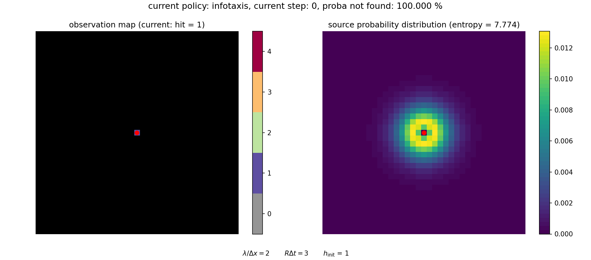
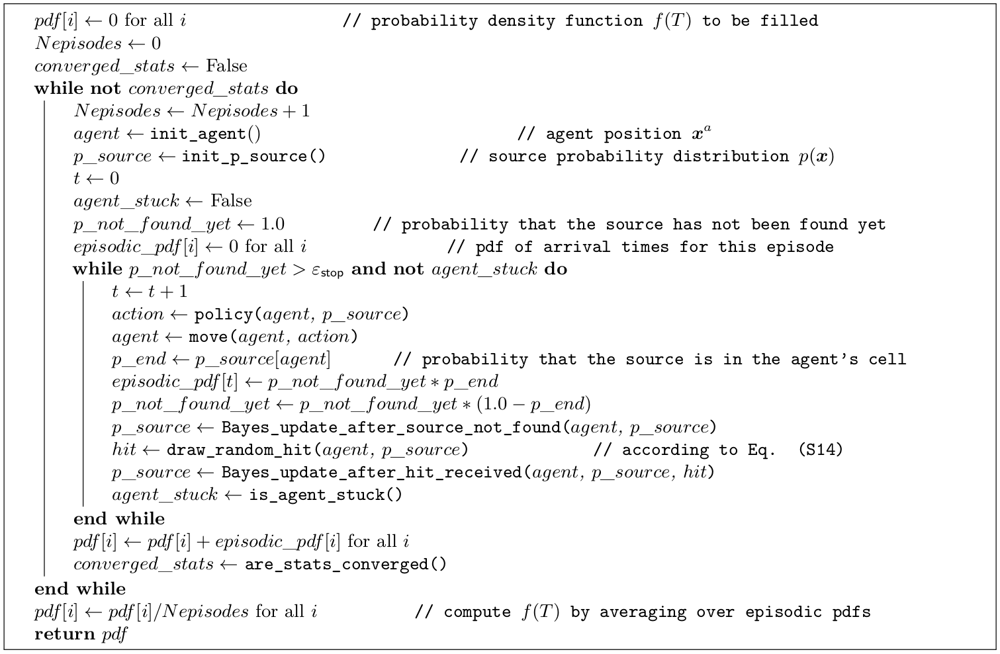

.. _sec-policy-evaluation:

===================
Evaluation protocol
===================

The methodology described hereinafter is implemented in ``evaluate.py`` (:ref:`sec-evaluate.py`).

Thanks to the :ref:`initialization protocol<sec-initialization>`,
the performance of a policy does not depend of an arbitrarily chosen initial distance between the source and the agent,
nor is affected by artificial finite-size effects.

Policy evaluation is performed by generating a large number of episodes and computing the resulting distribution of
arrival times :math:`T`, denoted here :math:`f(T)`, and defined such that its norm is the probability of (ever)
finding the source (which may not be equal to one), that is,

.. math::
   \begin{equation}
    \text{Pr}(\text{failure}) = 1 - \sum_T f(T).
   \end{equation}

Other moments of the distribution are computed after renormalization as usual, for example:

.. math::
   \begin{equation}
    \text{Mean}(T) = \sum_T T \tilde{f}(T), \qquad \text{Std}(T) = \sqrt{\sum_T T^2 \tilde{f}(T) - \text{Mean}(T)^2}
   \end{equation}

with :math:`\tilde{f}(T) = f(T) / \sum_T f(T)`.

The convergence of :math:`f(T)` with the number of episodes can be vastly improved by realizing that :math:`p({\bf x})`,
interpreted as the agent's belief in the context of decision-making, is also the true (in the Bayesian sense)
probability distribution of sources that could have generated the sequence of observations.
In this probabilistic approach, each episode can be continued until the probability of having found the source is equal
to one (within numerical accuracy ``STOP_p``) or until the agent is stuck in an infinite loop, and hits are drawn
at each step according to the distribution:

.. math::
   \begin{equation}
    \text{Pr}(h | {\bf x}^a) = \sum_{{\bf x}} \Pr(h | {\bf x}^a, {\bf x}) p({\bf x})
   \end{equation}

such that episodes can be generated independently of the true source location :math:`{\bf x}^s`.

A video illustrating how the search proceeds in this framework is shown below. It can be visualized with
``visualize.py`` (:ref:`sec-visualize.py`) using ``DRAW_SOURCE = False``.

  The search can be continued until the source is (almost) surely found.

This approach is particularly advantageous to sample rare events (such as failing to find the source) and more
generally to sample heavy-tailed distributions (as is :math:`f(T)`).
The pseudo-code for computing the distribution of arrival times is given in below.

  Pseudo-code for the policy evaluation algorithm.

