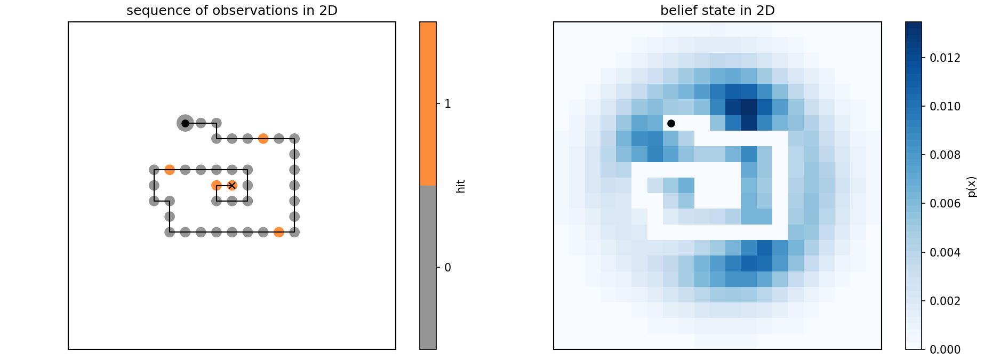

Description
===========

The source-tracking problem is a POMDP (partially observable Markov decision process) in which the agent seeks to
identify the true location of an imperfectly observed stationary target (a source of odor).
The environment is an :math:`n`-dimensional Cartesian grid and the source, invisible to the agent, is located in one
of the cells.
At each step, the agent moves to a neighbor cell and receives an observation (odor detection), which provides some
information on how far the source is.
The agent has a perfect memory and a perfect knowledge of the process that generates observations.
How should the agent behave in order to reach the source in the smallest possible number of steps?

We denote :math:`{\bf x}^s` and :math:`{\bf x}^a` the source and the agent locations (:math:`n`-tuples of integers),
respectively.
Allowed actions are moves to a neighbor cell along the grid axes, for example in 3D the set of allowed actions
is {'north', 'south', 'east', 'west', 'top', 'bottom'}, and staying in the same location is not allowed.
After moving to a cell, either the source is found (event :math:`F`) and the search is over, or the source is not found
(complementary event :math:`\bar{F}`) and the agent receives a stochastic sensor measurement :math:`h` ("hits"),
which represents the integer number of odor particles detected by the agent.
Hits are received with conditional probability :math:`\text{Pr}(h | {\bf x}^a,{\bf x}^s)` specified by an
:ref:`observation model<sec-model>`.
We encompass the presence/absence of the source and the number of hits in a single observation variable :math:`o`.
Possible observations are :math:`o \in \{ F, (\bar{F}, 0) , (\bar{F}, 1), (\bar{F}, 2), \dots \}`.

We denote :math:`p({\bf x})` the discrete probability distribution of the source being in each grid cell, that
is :math:`p({\bf x}) = \text{Pr}({\bf x}^s = {\bf x})`.
After each action and observation, :math:`p({\bf x})` can be updated using :ref:`Bayesian inference<sec-bayes>`.
The agent has access to its position :math:`{\bf x}^a` and to the distribution :math:`p({\bf x})`.
In the POMDP terminology, this defines a belief state :math:`s=[{\bf x}^a, p({\bf x})]`, as illustrated below.
Finding the source is a special belief state :math:`s^\Omega` where the source position is known and matches
the agent position: :math:`s^\Omega=[{\bf x}^a, \delta({\bf x} - {\bf x}^a)]`.
The agent's behavior is described by a policy, denoted :math:`\pi`, which maps each belief state to an action.

  Example of an observation sequence and corresponding belief state.

The search proceeds as follows:

- Initially

  - The belief state is :math:`s_0=[{\bf x}^a_0, p_0({\bf x})]`, where the agent location :math:`{\bf x}^a_0`
    is at the center of the domain and where the prior distribution of source location :math:`p_0({\bf x})` is drawn
    randomly from the :ref:`set of prior belief states<sec-initialization>`.
  - The source location :math:`{\bf x}^s` is drawn randomly according to :math:`p_0({\bf x})`.

- At the :math:`t^\text{th}` step of the search

  1. Knowing the current belief state :math:`s_t=[{\bf x}^a_t, p_t({\bf x})]`, the agent chooses an action
     according to some policy :math:`\pi`: :math:`a_{t} = \pi(s_t)`.
  2. The agent moves deterministically to the neighbor cell associated to :math:`a_{t}`.
     This move is associated to a unit cost. The agent's position is updated to :math:`{\bf x}^a_{t+1}`.
  3. The agent receives an observation :math:`o_{t}` and the source location distribution is :ref:`updated
     using Bayes' rule<sec-bayes>` to :math:`p_{t+1}({\bf x})`.

     - If :math:`s_{t+1} = s^\Omega`, that is :math:`{\bf x}^a_{t+1} = {\bf x}^s`, the search terminates and
       the agent receives no more costs.
     - Otherwise, the search continues to step :math:`t+1`.

Each episode (each search) is a sequence like this:

.. math::
   \begin{equation}
    s_0, a_0, o_0, s_1, a_1, o_1, \dots, s_{T-1}, a_{T-1}, o_{T-1}, s^\Omega
   \end{equation}

and the cumulated cost of an episode is equal to the number of steps :math:`T` to termination
(which can be infinite if the source is never found).

Episodes can be visualized with ``visualize.py`` (:ref:`sec-visualize.py`).
A :ref:`step-by-step<sec-stepbystep>` illustration depicting how a search proceeds is provided.
Some examples of episodes are shown in the :ref:`gallery<sec-gallery>`.

With our :ref:`initialization protocol<sec-initialization>`,
the source-tracking POMDP is parameterized by only three dimensionless parameters:

    - the dimensionality :math:`n`, called ``N_DIMS`` in the code
    - the dimensionless problem size :math:`L`, called ``LAMBDA_OVER_DX`` in the code
    - the dimensionless source intensity :math:`I`, called ``R_DT`` in the code

