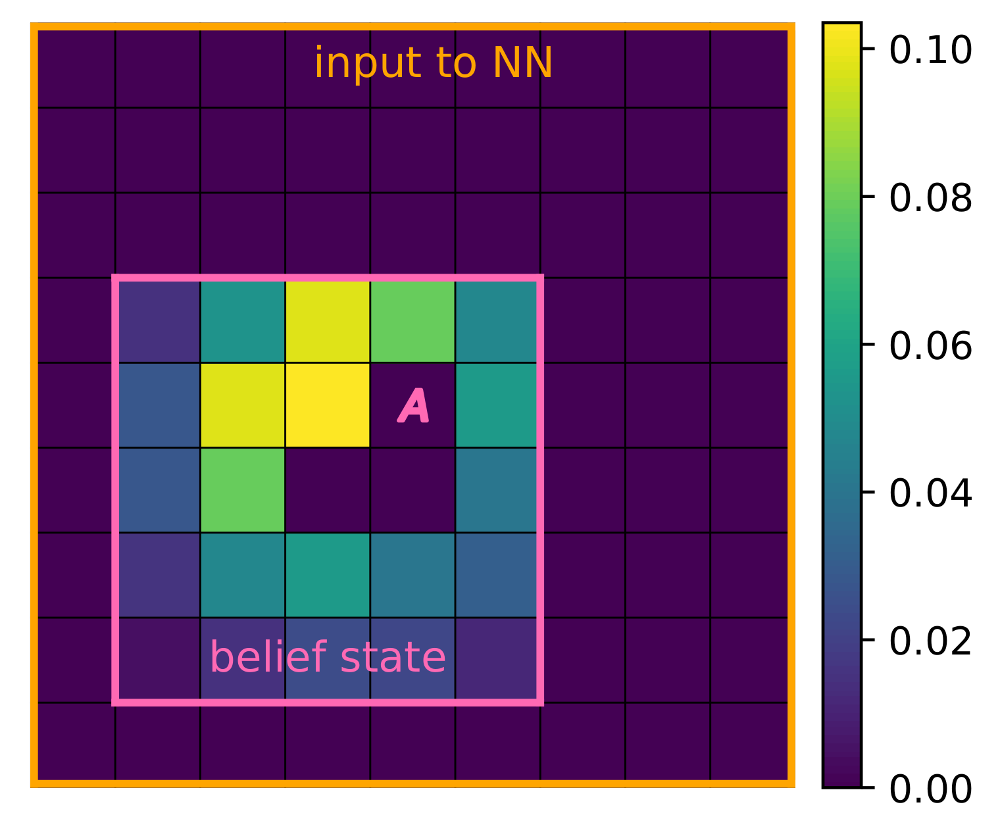
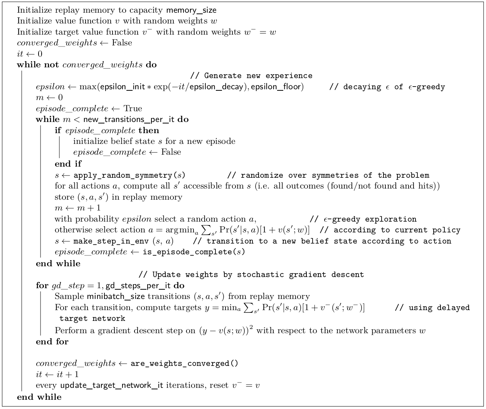

.. _sec-training:

==================
Training algorithm
==================

The reinforcement learning algorithm described hereinafter is implemented in ``learn.py`` (:ref:`sec-learn.py`).

Introduction
============

The optimal value function is approximated by :math:`\hat{v}(s; {\bf w}^*)`, a function computed by a multi-layer
neural network with weight vector :math:`{\bf w}`.

The Bellman optimality equation for the approximate value function is

.. math::
   \begin{equation}
   \hat{v}(s; {\bf w}^*) = \min_a \sum_{s'} \text{Pr}(s'|s,a) [ 1 + \hat{v}(s'; {\bf w}^*)]  \qquad  \forall s \neq s^\Omega
   \end{equation}

with :math:`\hat{v}(s^\Omega; {\bf w}^*) = 0`.

The problem consists in finding the weights :math:`{\bf w}^*` that allow this equation to be satisfied "at best",
that is, the weights that minimize the residual error.
This residual error, called the Bellman optimality error, reads

.. math::
   \begin{equation}
   L({\bf w}) = \mathbb{E}_{s} \left[ \min_a \sum_{s'} \text{Pr}(s'|s,a) [1 + \hat{v}(s'; {\bf w})] - \hat{v}(s; {\bf w}) \right]^2
   \end{equation}

where the expectation is taken over belief states :math:`s` visited when following the policy :math:`\hat{\pi}`
derived from :math:`\hat{v}` and defined by

.. math::
   \begin{equation}
   \hat{\pi}(s; {\bf w}) = \text{argmin}_a \, \sum_{s'} \Pr(s'|s,a) [1 + \hat{v}(s'; {\bf w})].
   \end{equation}

The functional :math:`L({\bf w})` is known as the "loss function", and "training" the network then refers to the iterative
update (through stochastic gradient descent) of the weights :math:`{\bf w}` so as to minimize this loss function.

Deep neural network
===================

Preprocessing
-------------

The belief state, which contains both the agent's position (an :math:`n`-tuple) and the source probability distribution
(an :math:`N^n` array, with :math:`N` the linear grid size and :math:`n` its dimensionality),
is equivalently represented as a source probability distribution centered on the agent (a :math:`(2N-1)^n` array).
This transformation, illustrated below, is applied to the belief state before
using it as an input to the neural network.

  The belief state (pink border and agent) is transformed into a probability distribution centered on the agent (orange border).

Architecture
------------

The neural network consists of fully connected layers:
the input layer, followed by hidden layers with rectifier linear units (ReLU) activations, and a linear output layer.
The network size (number of neurons per layer and number of hidden layers) can be chosen by the user.

Near-optimal policies can be obtained if large enough neural networks are used.
Typically 3 hidden layers are sufficient for most cases, and an increasing number of neurons per layer
is required for increasing problem sizes.

Algorithm
=========

The training algorithm is a custom model-based version of DQN (Mnih et al., Nature, 2015).
The pseudo-code is given below.

  Pseudo-code for the training algorithm (based on DQN).