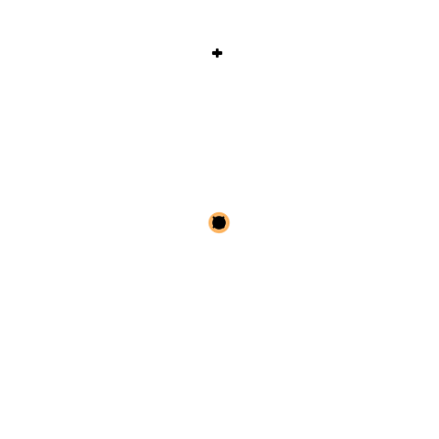

What is OTTO?
=============

OTTO (short for Odor-based Target Tracking Optimization) is a Python package to
**visualize, evaluate and learn strategies** for odor-based searches.

  Example of a 3D search with the popular **infotaxis** strategy.

OTTO implements:

    - a simulator of the source-tracking POMDP for any number of space dimensions
    - a rendering of searches in 1D, 2D and 3D
    - various heuristic policies, including infotaxis
    - a rigorous and efficient method to evaluate policies
    - a custom deep reinforcement learning algorithm able to yield near-optimal policies

OTTO has been used in a publication [Loisy2022]_.
